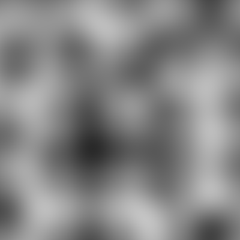
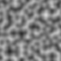
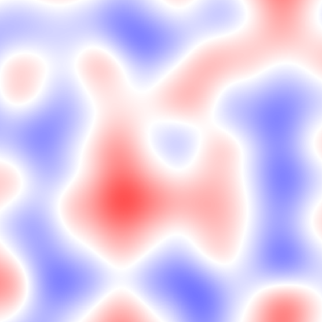
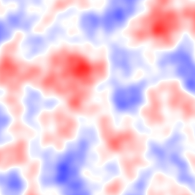

# Noise

Generate perlin noise.
For fun pet-project.

## Installation

Add the dependency to your `shard.yml`:

   ```yaml
   dependencies:
     noise:
       github: globoplox/noise
   ```

## Usage

## Programmatic

Instantiate a noise:  
`noise = Noise.new`  

Get the noise value at given cooridnates:  
`noise[0.456] # 1d `  
`noise[0.456, 0.678] # 2d `  
`noise[0.0, 0.0, 0.0, 0.0, 0.0] # or more`  

Basic noise function output a value between `-1.0` and `1.0`.  

Example of a 1d noise plotted:  

```cr
require "noise"

noise = Noise.new

heights = (0...100).map do |t|
  (noise[t / 20] + 1) * 10
end

(0...20).each do |l|
  heights.each do |v|
    if v >= (20 - l)
      STDOUT << '#'
    else
      STDOUT << ' '
    end
  end
  STDOUT << '\n'
end
```

```txt
                             ###                                                                    
                          #########                                                                 
                        ############                                                  ####          
                       ###############               #####                         ##########       
########            #####################         ###########                   #################   
###########       #########################    ################               ######################
################################################################             #######################
##################################################################         #########################
####################################################################     ###########################
####################################################################################################
####################################################################################################
####################################################################################################
####################################################################################################
####################################################################################################
```

Example of a 1d noise plotted:  

```cr
require "noise"

chars_2d = [' ', '.', '°', 'o', '0', 'O']

noise = Noise.new

(0...50).each do |y|
  (0...50).each do |x|
    v = noise[x / 10, y / 10]
    c = chars_2d[((v + 1) / 2 * chars_2d.size).to_i]
    STDOUT << c
    STDOUT << c
  end
  STDOUT << '\n'
end
```

```txt
oooooooooooooooooooooo°°°°°°......°°°°°°oooooooo000000oooooooo°°°°..........°°°°oooooooooooooooo°°°°
°°°°oooooooooooooooooo°°°°°°°°°°°°°°°°°°oooooo0000000000oooooo°°°°°°........°°°°°°oooooooooooo°°°°°°
°°°°°°oooooooo00oooooooo°°°°°°°°°°°°°°oooooo000000000000oooooo°°°°°°......°°°°°°°°oooooooooo°°°°°°°°
°°°°°°°°oooo000000oooooooooo°°°°°°°°oooooo00000000000000oooooooo°°°°°°°°°°°°°°°°oooooooooo°°°°°°°°°°
..°°°°°°oooo0000000000oooooooo°°oooooooo00000000000000oooooooooooo°°°°°°°°°°°°oooooooooooo°°°°°°....
..°°°°°°oooo0000000000oooooooooooooooooo00000000000000oooooooooooooooooooooooooooooooooooo°°°°°°....
..°°°°°°oooo0000000000oooooooooooooooooo0000000000oooooooooooooooooooooooooooooooooooooo°°°°°°°°°°..
°°°°°°oooo0000000000oooooooo°°°°°°oooooooooo00oooooooooooooooooooooo000000oooooooooooooo°°°°°°°°°°°°
°°°°oooooo000000oooooooooo°°°°°°°°°°oooooooooooooooo°°°°°°°°oooooo0000000000oooooooooo°°°°°°°°°°°°°°
°°oooooooo0000oooooooooo°°°°°°°°°°°°°°oooooooooooo°°°°°°°°°°oooooo0000000000oooooo°°°°°°°°°°oooooo°°
oooooooooo00oooooooooo°°°°°°°°°°°°°°°°°°oooooooo°°°°°°°°°°°°oooooooo000000oooooooo°°°°°°°°°°oooooooo
oooooooooooooooooo°°°°°°°°°°......°°°°°°°°°°°°°°°°°°°°°°°°°°°°oooooo0000oooooooo°°°°°°°°°°°°oooooooo
oooooooooooooooooo°°°°°°°°..........°°°°°°°°°°°°°°°°°°°°°°°°°°oooooo0000oooooo°°°°°°°°°°°°oooooooooo
oooooooooooooooo°°°°°°°°................°°°°°°°°°°°°°°°°°°°°°°oooooooo00oooooo°°°°°°°°°°°°oooooooooo
°°oooooooooooooo°°°°°°°°..................°°°°°°°°°°°°°°°°°°°°oooooo0000oooooooo°°°°°°°°°°oooooo00oo
°°°°oooooooooooo°°°°°°°°......  ..........°°°°°°°°°°°°°°°°°°°°oooooo000000oooooo°°°°°°°°oooooooo00oo
°°°°°°oooooooooo°°°°°°°°..................°°°°°°°°°°°°°°°°°°°°oooooo000000oooooooo°°°°°°oooooooooooo
°°°°°°oooooooooooo°°°°°°................°°°°°°°°°°°°°°°°°°°°°°oooooo00000000oooooooo°°oooooooooooooo
°°°°°°oooooooooooooo°°°°°°............°°°°°°°°°°°°°°°°°°°°°°°°oooo0000000000oooooooo°°oooooooooooooo
°°°°oooooooooooooooo°°°°°°..........°°°°°°°°oo°°°°°°°°°°°°°°oooooo0000000000oooooo°°°°°°oooooooooooo
oooooooooooooooooooooo°°°°°°......°°°°°°oooooooo°°°°°°°°°°°°oooooo00000000oooooooo°°°°°°°°oooooooooo
oooooooooo0000oooooooo°°°°°°....°°°°°°°°oooooooooo°°°°°°°°°°oooooooo000000oooooo°°°°°°°°°°oooooooooo
oooooooo00000000oooooo°°°°°°°°°°°°°°°°oooooooooooo°°°°°°°°°°oooooo00000000oooo°°°°°°°°°°°°°°oooooooo
oooooo0000000000oooooo°°°°°°°°°°°°°°°°oooooooooooo°°°°°°°°oooooooo00000000oooooo°°°°°°°°°°°°oooooooo
oooooooo00000000oooooooo°°°°°°°°°°°°°°oooooooooooo°°°°°°oooooooo0000000000oooooo°°°°°°°°°°°°oooooooo
oooooooooo000000oooooooo°°°°°°°°°°°°°°°°°°°°°°°°°°°°°°oooooooooo0000000000oooooooo°°°°°°°°°°oooooooo
oooooooooooooooooooooooo°°°°°°°°°°°°°°°°°°°°°°°°°°°°°°oooooooooo000000000000oooooooo°°°°°°°°°°oooooo
oooooooooooooooooooooooo°°°°°°°°°°°°°°°°°°°°°°°°°°°°°°oooooooooooo0000000000oooooooooo°°°°°°°°°°oooo
oo°°°°°°°°oooooooooooooo°°°°°°°°°°°°°°°°°°°°°°°°°°°°°°°°oooooooooooo000000oooooooooooo°°°°°°°°°°°°oo
oo°°°°°°°°°°oooooooooo°°°°°°°°°°°°oooo°°°°°°°°°°°°°°°°°°oooooooooooooooooooooooooooo°°°°°°°°°°°°°°°°
oo°°°°°°°°°°oooooooooo°°°°°°°°°°oooooooooo°°°°°°°°°°°°°°°°°°oooooooooooooooooooooo°°°°°°°°°°°°°°°°°°
oo°°°°°°°°°°oooooooo°°°°°°°°°°°°oooooooooooo°°°°°°°°°°°°°°°°°°°°°°oooooooooooo°°°°°°°°°°......°°°°°°
oo°°°°°°°°°°oooooooo°°°°°°°°°°oooooooooooooooo°°°°°°°°°°°°°°°°°°°°°°°°oooo°°°°°°°°°°°°°°......°°°°°°
oooo°°°°°°oooooooooo°°°°°°°°oooooooo00oooooooooo°°°°°°°°°°°°°°°°°°°°°°°°°°°°°°°°°°°°°°°°°°°°°°°°°°°°
oooooooooooooooooooooooooooooooo0000000000oooooooo°°°°°°°°°°°°°°°°°°°°°°°°°°°°°°°°°°°°°°°°°°°°°°°°°°
oooooooooooooooooooooooooooooo000000000000oooooooooo°°°°°°°°°°°°°°°°°°°°°°°°°°°°°°°°°°°°°°°°°°°°°°°°
oooooooooooooooooooooooooooo00000000000000oooooooooooooooooo°°°°°°°°°°°°°°°°°°°°°°oooooooooooooooooo
oooooooooooooooooooooooooooo000000000000oooooooooooooooooooooo°°°°°°°°°°°°°°°°°°oooooooooo00oooooooo
oooooooooooooooooooooooooooo00000000oooooooooooooooooooooooooo°°°°°°°°..°°°°°°°°oooooo0000000000oooo
oooooooooooooooooooooooooooooo00oooooooooooo°°oooooooooooooooo°°°°°°......°°°°°°oooooo0000000000oooo
oooooooooo°°°°°°°°°°oooooooooooooooooooooo°°°°°°°°oooooooooooo°°°°°°......°°°°°°oooooooo000000oooooo
°°°°°°°°°°°°°°°°°°°°°°°°oooooooooooooo°°°°°°°°°°°°°°oooooooo°°°°°°..........°°°°°°oooooo000000oooooo
°°°°°°°°°°°°°°°°°°°°°°°°°°oooooooooo°°°°°°°°°°°°°°°°°°°°°°°°°°°°°°..........°°°°°°°°oooooo00oooooooo
°°°°°°°°°°°°°°°°°°°°°°°°°°oooooo°°°°°°°°°°......°°°°°°°°°°°°°°°°..............°°°°°°°°oooooooooooooo
°°°°°°°°°°°°°°°°°°°°°°°°°°oooooo°°°°°°°°..........°°°°°°°°°°°°..................°°°°°°°°oooooooooooo
°°°°°°°°°°°°°°°°°°°°°°oooooooooo°°°°°°............°°°°°°°°°°°°....................°°°°°°oooooooooooo
°°°°oooooooo°°°°°°°°oooooooooooo°°°°°°°°..........°°°°°°°°°°°°......................°°°°°°oooooooooo
°°oooooooooooo°°°°oooooooooooooooo°°°°°°°°......°°°°°°°°°°°°°°°°..............°°°°°°°°°°°°oooooooooo
oooooooooooooooooooooooooooooooooooo°°°°°°°°°°°°°°°°°°°°°°°°°°°°°°......°°°°°°°°°°°°°°°°oooooooooooo
oooooooooooooo°°°°oooooooooooooooooooo°°°°°°°°°°°°°°oooooo°°°°°°°°°°°°°°°°°°°°°°°°°°°°°°oooooooooooo
```

Noise can be periodic and can be warpped into transformations, including:
- Offsets
- Frequencies
- Gain (by multiplication and addition)
- Sum of noise function

```cr
noise = Noise.new(
  offsets: {1.0, 0.0},
  child: (
    Noise.new(periods: {5u32, 5u32}) +
    Noise.new(frequencies: {4.0, 4.0}) / 4) -
  0.25
)
```

### Faster picture specialized API

The module `Noise::Fast2D` exposes functions to build simple 2D noises: 

`Noise::Fast2D.noise(width : UInt32, height : UInt32, resolution : UInt32, data : Bytes, x_offset : Int32 = 0, y_offset : Int32 = 0)`
will fill the given `data` slice with 2D noise level from `0` to `255`. It expects data to be a flattend 2D array (`i = y * w + x`), 
of size `resolution * width * resolution * height`. Parameters `width`, `height`, `x_offset` and `y_offset` specify the amount of cells of `resolution X resolution` pixel to draw.

`Noise::Fast2D.concurrent(..., workers: UInt8)` accepts the same parameters and does the perform the same task, but will use concurrency to speed up the process. If paired with compilation flag `-Dpreview_mt` and an addequate `CRYSTAL_WORKERS` envrionnement variable value at runtime, it can significantly speed up the process of generating a simple 2D noise picture:

```sh
crystal build --release -Dpreview_mt src/cli.cr

# CLI tool with the default implementation:
time CRYSTAL_WORKERS=4 ./cli -w 4000 -h 4000 -r 10 > /dev/null
# => CRYSTAL_WORKERS=4 ./cli -w 4000 -h 4000 -r 10 > /dev/null  19.55s user 0.47s system 100% cpu 19.870 total
# CLI tool with the specialized implementation:
time CRYSTAL_WORKERS=4 ./cli -f -w 4000 -h 4000 -r 10 > /dev/null 
# => CRYSTAL_WORKERS=4 ./cli -f -w 4000 -h 4000 -r 10 > /dev/null  0.30s user 0.01s system 338% cpu 0.093 total
```

## Standalone

This project come with a standalone CLI tool for generating 2D perlin noise pictures:  

`shards build cli`

Build a 400x400 pixel grayscale bitmap with 100x100 pixels within each gradient cell:  

`./bin/cli > noise.bmp`



Build a 100x100 pixel bitmap with 10x10 pixels within each gradient cell:  
`./bin/cli --width 100 --height 100 --resolution 10 > noise.bmp`  



### Colors

Colors output can be customized:  
`./bin/cli --colors '255,0,0 - 255,255,255 - 0,0,255' > noise.bmp`  


In this example, the color space is divided in two continuous range: 
- from pure red (rgb 255, 0, 0) to pure white (rgb 255, 255, 255)
- from pure white (rgb 255, 255, 255) to pure blue (rgb 0, 0, 255)

Each color is specified in rgb format:  
`<red: 0-255>,<green: 0-255>,<blue: 0-255>`  
There can be from 2 to any number of color, the color space will span evenly on each ranges.  

### Noise function transformation and composition

The noise function that is drawn can be customized:  
`./bin/cli --colors '255,0,0 - 255,255,255 - 0,0,255' 'n + n[freq 2] / 2 + n[freq 4] / 4'  > noise.bmp`



The noise function is specified as an expression:
- `n` is a simple noise function
- `n + 1.0` for controlling gain: `n + 1`, `n + -2.76`, `n - 0.05`
- `n * 0.5` for controlling intensity: `n * 2`, `n / 2`, `n * 0.5`, `n * 1 / 2`
- `n + n` for adding noise function together
- `n + n * 2` expected operation order and associativity applies
- `(n + n) * 2` parenthesis can be used
- `n + n[offset 0.5]` noise function can be transformed by offseting it
- `n + n[freq 10.0]` noise fucntion can be transformed by increasing the frequency
- `n + n[freq 10.0 offset 0.5]` parameters can be grouped
- `n + n[freq 2][freq 2]` transformations can be chained
- `n[period 5 freq 3]` a root noise function can be made periodic
- `n[period x:5 freq 3]` period, frequency and offset parameters can be set for a specific dimension

## Performance

The generic implementation has poor performance.  

Another implementation specialized with rendering 2D arrays of noise values has been added:

### 
Building a 800x800 pixels, 8x8 gradients bmp picture, took on average on my laptop (i7-7500U (2 cores 4 threads)):
- With `Noise::Fast2D`: around 50ms
- With `Noise::Fast2D` `-Dpreview_mt` `CRYSTAL_WORKERS=1`: around 50ms
- With `Noise::Fast2D` `-Dpreview_mt` `CRYSTAL_WORKERS=2`: around 38ms
- With `Noise::Fast2D` `-Dpreview_mt` `CRYSTAL_WORKERS=4`: around 32ms
- With `Noise::Fast2D` `-Dpreview_mt` `CRYSTAL_WORKERS=8`: around 32ms
- With `Noise::Fast2D` `-Dpreview_mt` `CRYSTAL_WORKERS=16`: around 32ms
- With `Noise::Fast2D`, `--release`: around 12ms
- With `Noise::Fast2D`, `--release`, `-Dpreview_mt` `CRYSTAL_WORKERS=1`: around 12ms
- With `Noise::Fast2D`, `--release`, `-Dpreview_mt` `CRYSTAL_WORKERS=4`: around 4ms
